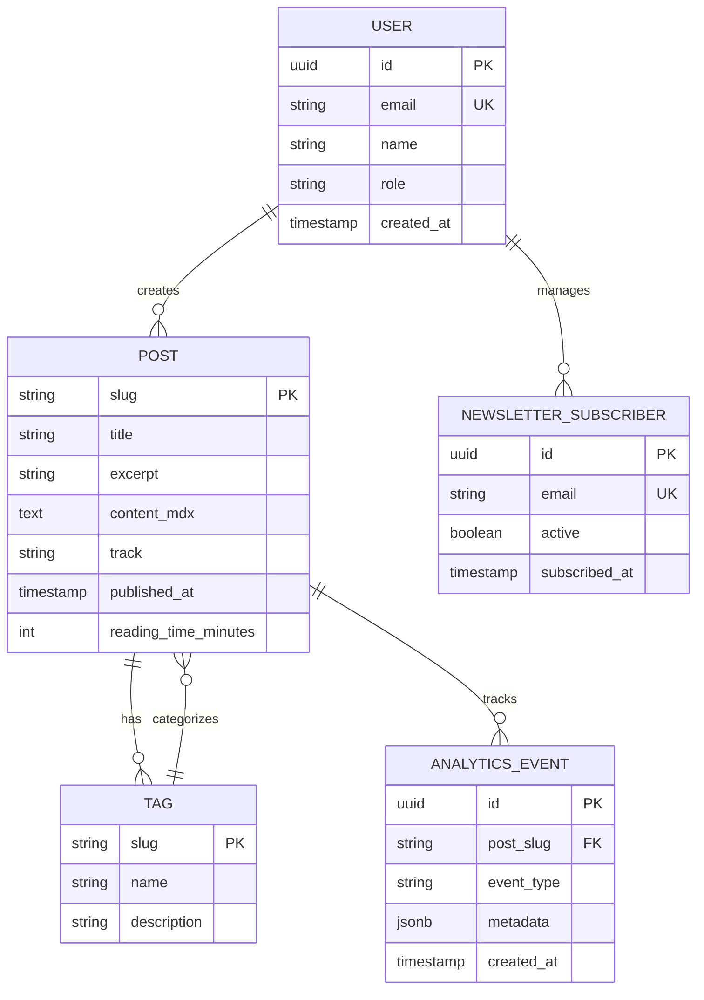

# Data Architecture

**Last Updated**: 2025-10-26
**Related Docs**: See `system-architecture.md` for data flows, `tech-stack.md` for database choices

## High-Level Domain Model

**Purpose**: Define major entities and their relationships (technology-agnostic)



**Note**: Currently, most entities are stored as MDX files (filesystem), not database. Database schema is prepared for future growth.

---

## Entities & Schemas

### Entity: User

**Purpose**: Represents site administrator (Marcus) or future collaborators

**Fields**:

| Field | Type | Constraints | Purpose |
|-------|------|-------------|---------|
| `id` | String (CUID) | PK | Unique identifier |
| `email` | String (255) | UNIQUE, NOT NULL | User email |
| `name` | String (200) | NULLABLE | Display name |
| `created_at` | Timestamp | NOT NULL, DEFAULT NOW() | Account creation |
| `updated_at` | Timestamp | NOT NULL, AUTO-UPDATE | Last modified |

**Relationships**:
- Has many: Post (future, when posts move to DB)
- Has many: Newsletter subscribers (manages)

**Validation Rules**:
- Email must be valid format (Zod validation)
- Email must be unique

**Indexes**:
- `users_email_idx` ON (email) - Unique constraint, fast lookup

**Current Status**: Placeholder model in Prisma schema, not actively used

---

### Entity: Post (Future)

**Purpose**: Blog post content (currently MDX files, future DB storage)

**Current Storage**: Filesystem (`content/posts/*.mdx`)

**Future Schema** (when migrated to DB):

| Field | Type | Constraints | Purpose |
|-------|------|-------------|---------|
| `slug` | String (100) | PK | URL-friendly identifier (e.g., "systematic-thinking") |
| `title` | String (200) | NOT NULL | Post title |
| `excerpt` | String (500) | NOT NULL | Short summary |
| `content_mdx` | Text | NOT NULL | Full MDX content |
| `track` | ENUM('aviation', 'dev-startup') | NOT NULL | Content category |
| `published_at` | Timestamp | NOT NULL | Publication date |
| `reading_time_minutes` | Integer | NOT NULL, >= 1 | Calculated reading time |
| `featured_image_url` | String | NULLABLE | Cover image |
| `author_id` | String (CUID) | FK → users(id) | Post author |
| `created_at` | Timestamp | NOT NULL, DEFAULT NOW() | Creation time |
| `updated_at` | Timestamp | NOT NULL, AUTO-UPDATE | Last edit |

**Relationships**:
- Belongs to: User (author)
- Many-to-many: Tag (via PostTag junction table)

**Validation Rules**:
- Slug must be URL-safe (lowercase, hyphens only)
- Reading time must be positive integer
- Track must be 'aviation' or 'dev-startup'
- Published_at cannot be in future

**Indexes**:
- `posts_slug_idx` ON (slug) - Primary key, fast lookup
- `posts_track_published_idx` ON (track, published_at DESC) - List posts by category
- `posts_published_at_idx` ON (published_at DESC) - Recent posts query

---

### Entity: Tag (Future)

**Purpose**: Content categorization (e.g., "flight-training", "nextjs", "startups")

**Current Storage**: Extracted from MDX frontmatter

**Future Schema**:

| Field | Type | Constraints | Purpose |
|-------|------|-------------|---------|
| `slug` | String (50) | PK | URL-friendly identifier |
| `name` | String (50) | NOT NULL | Display name |
| `description` | String (200) | NULLABLE | Tag description |
| `post_count` | Integer | DEFAULT 0 | Cached count (updated on post publish/unpublish) |

**Relationships**:
- Many-to-many: Post (via PostTag junction table)

**Indexes**:
- `tags_slug_idx` ON (slug) - Primary key
- `tags_post_count_idx` ON (post_count DESC) - Popular tags

---

### Entity: Newsletter Subscriber (Future)

**Purpose**: Email subscribers for newsletter

**Future Schema**:

| Field | Type | Constraints | Purpose |
|-------|------|-------------|---------|
| `id` | String (CUID) | PK | Unique identifier |
| `email` | String (255) | UNIQUE, NOT NULL | Subscriber email |
| `active` | Boolean | NOT NULL, DEFAULT true | Subscription status |
| `subscribed_at` | Timestamp | NOT NULL, DEFAULT NOW() | Signup date |
| `unsubscribed_at` | Timestamp | NULLABLE | Unsubscribe date |
| `source` | String (50) | NULLABLE | Signup source (footer, popup, etc.) |

**Relationships**:
- None (standalone)

**Validation Rules**:
- Email must be valid format
- Email must be unique

**Indexes**:
- `newsletter_email_idx` ON (email) - Unique constraint
- `newsletter_active_idx` ON (active) - Active subscribers query

---

## Storage Strategy

### Primary Data Storage

**Type**: Hybrid (Filesystem + Relational Database)

**Current State**:
- **Content (Posts, Tags)**: Filesystem (MDX files in `content/posts/`)
- **User Data**: PostgreSQL (minimal usage, prepared for growth)

**Rationale**:
- **Filesystem MDX**: Simple, version-controlled, fast static generation
- **PostgreSQL**: Structured data (future: subscribers, analytics, comments)

**Migration Path**:
- MVP (current): MDX files sufficient for <50 posts
- Growth (50-200 posts): Migrate to headless CMS (Contentful) or DB
- Scale (200+ posts): Database-first with API-based authoring

### Blob Storage

**Type**: Filesystem (currently) or CDN (future)
**Technology**: Local filesystem → Cloudflare R2 or S3 (if images grow)

**What to Store**:
- Featured images for blog posts
- Author profile photos
- Embedded media (diagrams, screenshots)

**Organization**: `/public/images/posts/[slug]/[filename].[ext]`
**Size Limits**: Max 5MB per image (resize/compress before commit)

**Future**: If images > 100MB total, migrate to Cloudflare R2 or S3

---

## Data Access Patterns

### Read Patterns

**Pattern: Homepage Post Feed**
- **Query**: Get recent posts from both tracks, sorted by date
- **Current**: Filesystem scan (`content/posts/*.mdx`), parse frontmatter
- **Frequency**: Every page load (build-time for SSG)
- **Optimization**: Static generation at build time, no runtime queries

**Pattern: Single Post Page**
- **Query**: Get post by slug
- **Current**: Read `content/posts/[slug].mdx`
- **Frequency**: Every post page load (build-time for SSG)
- **Optimization**: Static generation, all posts pre-rendered

**Pattern: Posts by Tag**
- **Query**: Get posts with specific tag
- **Current**: Filesystem scan, filter by frontmatter tag
- **Frequency**: Tag page loads (build-time for SSG)
- **Optimization**: Static generation, pre-build tag index

### Write Patterns

**Pattern: Create New Post**
- **Operation**: Create new `.mdx` file
- **Frequency**: 2-4 times per month
- **Process**:
  1. Create `content/posts/[slug].mdx`
  2. Add frontmatter (title, date, tags, excerpt)
  3. Write MDX content
  4. Git commit + push
  5. CI/CD triggers rebuild + deploy

**Pattern: Newsletter Signup (Future)**
- **Operation**: INSERT into newsletter_subscribers
- **Frequency**: ~5-10 per week (estimated)
- **Consistency**: Strong (ACID transaction)
- **Example**:
  ```sql
  INSERT INTO newsletter_subscribers (email, source, subscribed_at)
  VALUES ($1, $2, NOW())
  ON CONFLICT (email) DO UPDATE SET active = true;
  ```

---

## Data Lifecycle

### Retention Policy

| Data Type | Retention Period | Archive Strategy | Delete Strategy |
|-----------|------------------|------------------|----------------|
| Blog posts | Indefinite | Git history | Never (content is permanent) |
| Newsletter subscribers | Indefinite (while active) | N/A | Hard delete on unsubscribe request (GDPR) |
| Analytics events | 13 months | Export to CSV after 13 months | Delete older than 13 months |
| User sessions | N/A (no auth) | N/A | N/A |

### Backup Strategy

**Database**:
- **Frequency**: Daily automated backups (Supabase managed)
- **Retention**: 7 daily, 4 weekly
- **Recovery Point Objective (RPO)**: 24 hours (acceptable data loss)
- **Recovery Time Objective (RTO)**: 2 hours (restore from backup)
- **Testing**: Quarterly restore tests

**Content (MDX files)**:
- **Backup**: Git history (GitHub)
- **Retention**: Permanent (Git never forgets)
- **Recovery**: Git checkout previous commit
- **Redundancy**: GitHub servers + local clones

---

## Privacy & Compliance

### Personal Identifiable Information (PII)

**What PII Stored**:
- Newsletter subscriber emails (future)
- User email (Marcus only, admin)

**How Protected**:
- Encryption at rest (PostgreSQL via Supabase)
- Encryption in transit (TLS 1.3)
- No PII in analytics (GA4 configured without userId tracking)
- No PII in logs (emails masked in application logs)

### Regulatory Compliance

**Requirements**: GDPR (EU visitors), CCPA (California visitors)

**How Compliant**:
- **Right to deletion**: Unsubscribe endpoint hard deletes subscriber record
- **Data portability**: Newsletter API endpoint exports subscriber data as JSON
- **Consent management**: Explicit opt-in for newsletter (no pre-checked boxes)
- **Privacy policy**: Clearly states data collection practices (GA4, newsletter)
- **Cookie consent**: [NEEDS CLARIFICATION: Cookie banner for GDPR?]

---

## Multi-Tenancy Strategy

**Model**: Single-tenant (personal blog)
**Isolation**: Not applicable (no multi-tenancy)

**Future Consideration**: If platform opens to guest authors, implement:
- Row-Level Security (RLS) on posts table (author_id filter)
- RBAC roles (admin, author, reader)

---

## Data Integrity

### Constraints

**Entity: User**
**Constraints**:
- `UNIQUE(email)` - No duplicate emails
- `CHECK(email ~* '^[A-Za-z0-9._%+-]+@[A-Za-z0-9.-]+\.[A-Z|a-z]{2,}$')` - Valid email format

**Entity: Post (Future)**
**Constraints**:
- `CHECK(reading_time_minutes > 0)` - Positive reading time
- `CHECK(track IN ('aviation', 'dev-startup'))` - Valid track
- `CHECK(published_at <= NOW())` - Cannot publish in future

**Entity: Newsletter Subscriber (Future)**
**Constraints**:
- `UNIQUE(email)` - No duplicate subscribers
- `CHECK(active IN (true, false))` - Boolean constraint

### Referential Integrity

**Future Cascade Rules**:
- Delete user → CASCADE delete authored posts (rare, admin only)
- Delete post → CASCADE delete post-tag associations
- Delete tag → SET NULL on posts (tags soft-delete, posts keep slug reference)

---

## Migrations Strategy

**Tool**: Prisma Migrate
**Process**:
1. Update `prisma/schema.prisma`
2. Generate migration: `npx prisma migrate dev --name add_newsletter_table`
3. Review generated SQL (manual check)
4. Test locally (apply migration, verify data)
5. Commit migration files to Git
6. Deploy: CI runs `npx prisma migrate deploy` on VPS

**Rollback**:
- Prisma migrations are one-way by default
- For rollback: Create new migration to reverse changes
- Database backups are safety net (restore if migration breaks data)

**Zero-Downtime Migrations** (if needed later):
- Expand-contract pattern for breaking changes
- Example: Renaming column
  1. Add new column (nullable)
  2. Deploy code (dual-write to both columns)
  3. Backfill data
  4. Deploy code (read from new column)
  5. Drop old column

---

## Scalability Considerations

### Current Capacity

**Database**: PostgreSQL on Hetzner VPS
- Storage: 80GB (plenty for text-heavy blog)
- Connections: 100 (overkill for current usage)
- Estimated capacity: 10,000+ posts, 100,000+ newsletter subscribers

**Limitations**:
- Single instance (no read replicas)
- Vertical scaling only (upgrade VPS RAM/CPU)

### Scale Path

**1,000 → 10,000 posts**:
- Migrate content from MDX to database (for better search, filtering)
- Add full-text search index (PostgreSQL tsvector)
- Cost: No change (fits on same VPS)

**10,000 → 100,000 posts** (unlikely for personal blog):
- Separate content database from application database
- Read replicas for heavy queries
- Cost: +$20-30/mo

---

## Disaster Recovery

### Backup & Restore

**Backup Location**: Supabase automated backups (VPS local storage)
**Restore Process**:
1. Stop Next.js container
2. Restore PostgreSQL from latest backup (Supabase CLI or pg_restore)
3. Verify data integrity (spot-check posts, subscribers)
4. Restart Next.js container
5. Test critical flows (homepage, post pages)

**Last Tested**: [NEEDS CLARIFICATION: Backup restore tested?]

### Corruption Recovery

**Scenario**: MDX files accidentally deleted or corrupted
**Detection**: Build fails (missing posts), manual discovery
**Recovery**:
1. Git checkout previous commit
2. Restore missing/corrupted files
3. Rebuild and redeploy

**Scenario**: Database corruption (subscriber data lost)
**Detection**: Supabase alerts, manual check
**Recovery**:
1. Restore from latest backup (RPO 24 hours)
2. Notify subscribers of gap (if critical)
3. Post-mortem doc

---

## Query Patterns & Optimization

### Slow Query Log

**Threshold**: > 1 second (if database queries added)
**Action**: Log to application logs, review monthly for optimization

### Index Strategy

**Entity: Post (Future)**
**Indexes**:
- `(slug)` - PRIMARY KEY, single-post lookups
- `(track, published_at DESC)` - List posts by category
- `(published_at DESC)` - Recent posts homepage feed

**Entity: Newsletter Subscriber (Future)**
**Indexes**:
- `(email)` - UNIQUE, signup/unsubscribe lookups
- `(active)` - Filter active subscribers for email sends

---

## Data Quality

### Validation

**Level 1: Database** (hard constraints)
- `email` format validation (CHECK constraint)
- `UNIQUE` constraints (no duplicate emails, slugs)
- `NOT NULL` constraints (required fields)

**Level 2: Application** (business rules)
- Zod schemas validate API inputs (newsletter signup)
- Frontmatter validation for MDX posts (required fields)
- Slug generation (title → URL-safe slug)

**Level 3: User Input** (form validation)
- Email format validation (client-side, HTML5)
- Required field indicators
- Character limits (displayed, enforced)

---

## Change Log

| Date | Change | Reason | Impact |
|------|--------|--------|--------|
| 2025-10-26 | Initial data architecture documented | Project initialization | Baseline for future migrations |
| 2025-10-26 | Hybrid storage strategy (MDX + DB) | Simple MVP, scalable future | Fast development, easy migration path |
