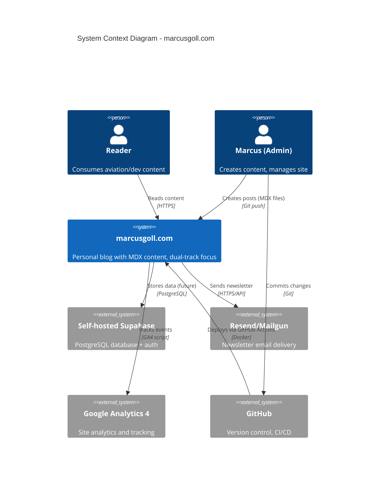
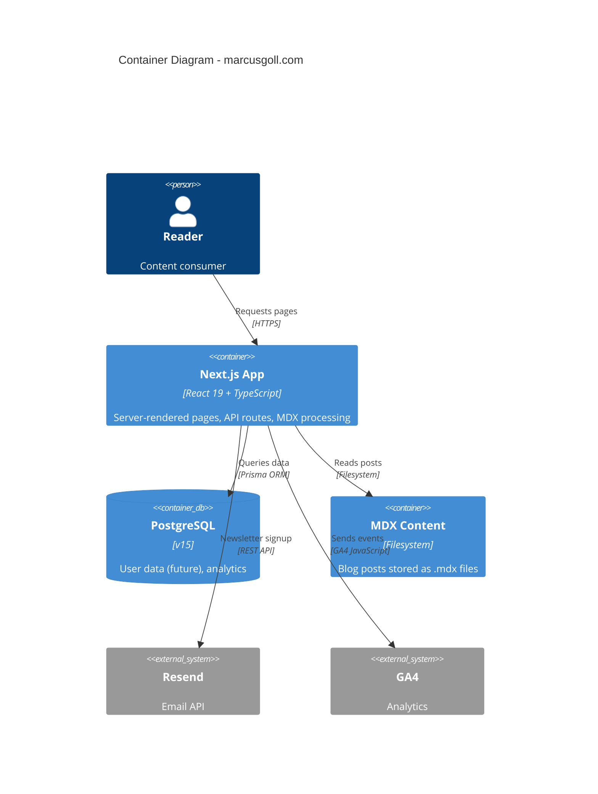
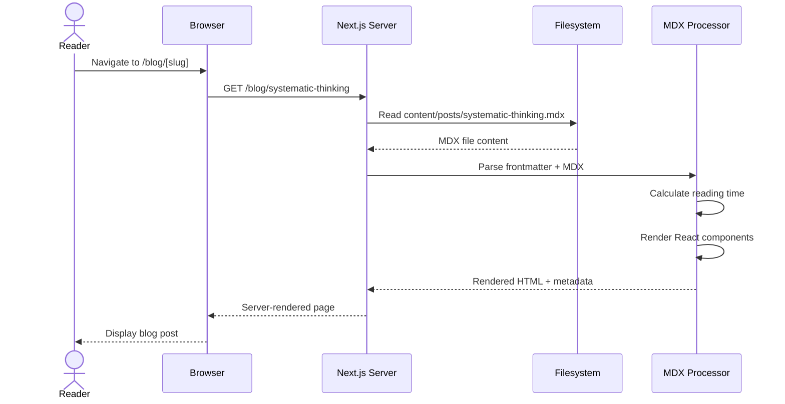
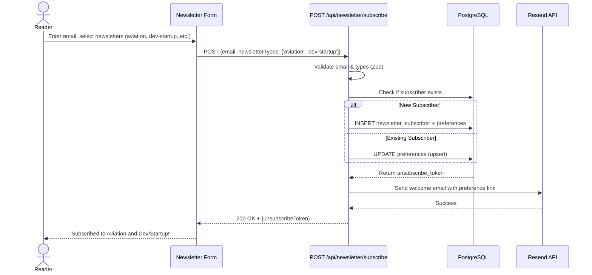
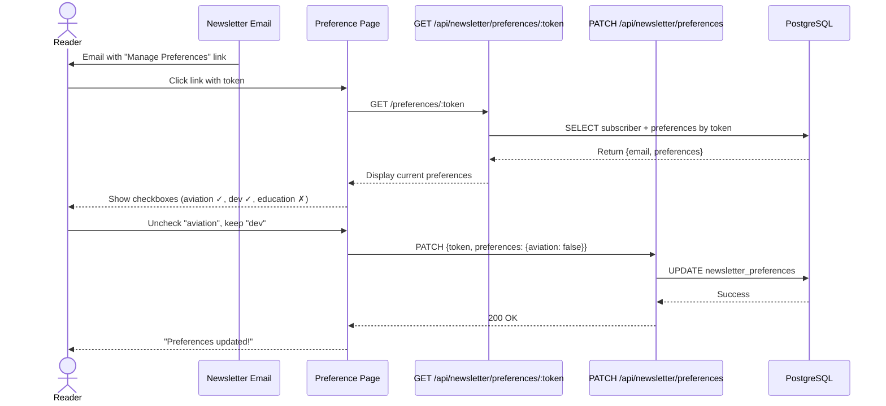
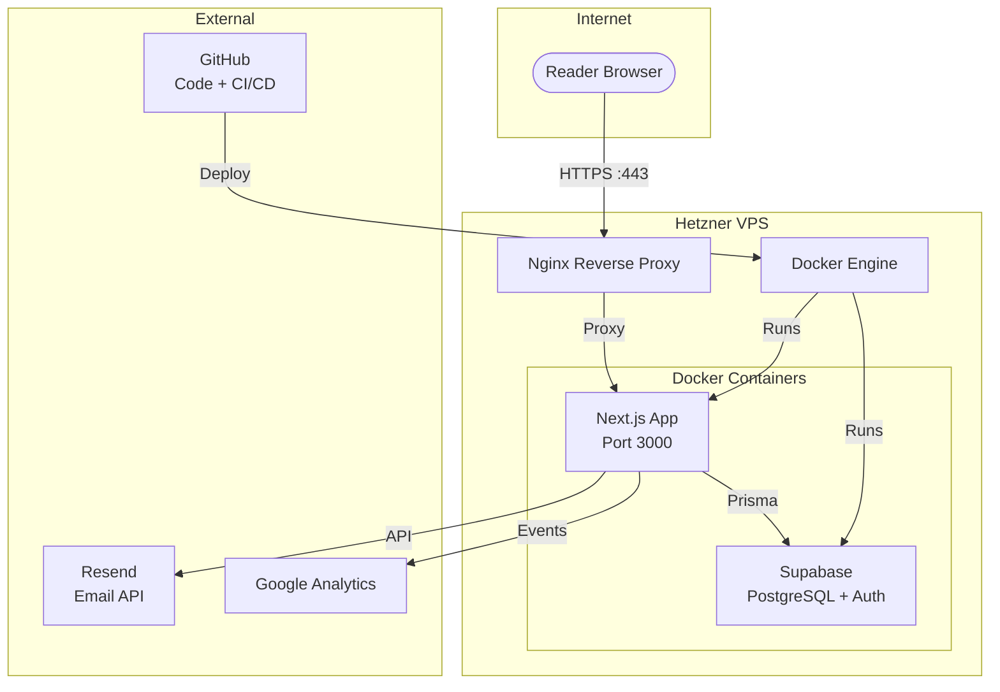
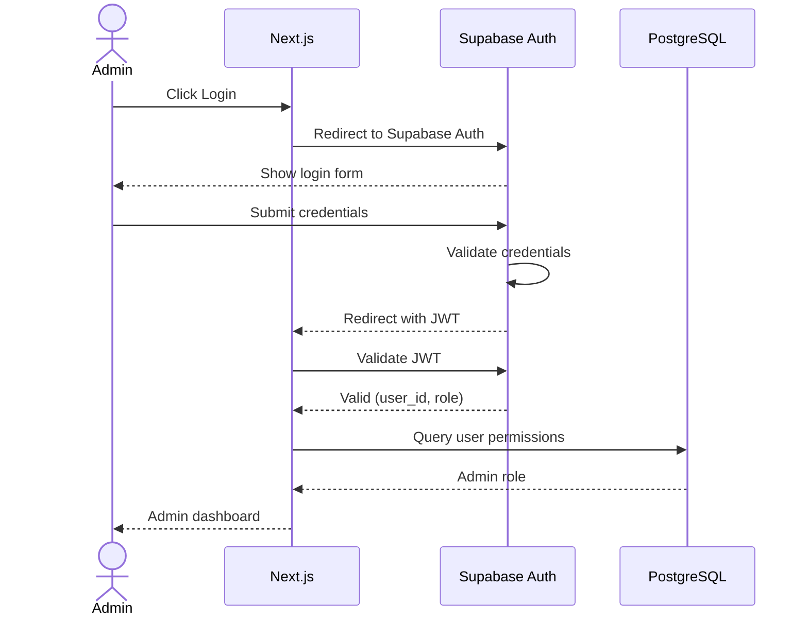

# System Architecture

**Last Updated**: 2025-10-26
**Architecture Style**: Monolith (Next.js full-stack application)
**Related Docs**: See `tech-stack.md` for technology choices, `deployment-strategy.md` for infrastructure

## System Context (C4 Level 1)

**High-level view: How does our system fit in the wider world?**



---

## Container Diagram (C4 Level 2)

**Major components and how they communicate:**



---

## Component Architecture

### Frontend Components

**Structure**: Next.js App Router with component-based architecture

```
app/
├── (routes)
│   ├── page.tsx                 # Homepage (post feed)
│   ├── layout.tsx               # Root layout (nav, footer)
│   ├── aviation/                # Aviation content section
│   ├── dev-startup/             # Dev/startup content section
│   ├── blog/                    # Blog list and post pages
│   │   └── [slug]/page.tsx      # Dynamic blog post page
│   └── tag/[tag]/               # Tag filtering pages
│
├── api/                         # API routes
│   └── newsletter/route.ts      # Newsletter signup endpoint
│
└── globals.css                  # Tailwind base styles

components/
├── layout/                      # Layout components
│   ├── header.tsx               # Site header with nav
│   ├── footer.tsx               # Site footer
│   └── theme-toggle.tsx         # Dark mode toggle
│
├── blog/                        # Blog-specific components
│   ├── post-card.tsx            # Post preview card
│   ├── post-header.tsx          # Post title, date, metadata
│   ├── post-content.tsx         # MDX content wrapper
│   └── reading-time.tsx         # Reading time indicator
│
├── mdx/                         # MDX custom components
│   ├── callout.tsx              # Info/warning callouts
│   ├── code-block.tsx           # Syntax highlighted code
│   └── image.tsx                # Optimized images
│
└── ui/                          # Reusable UI primitives
    ├── button.tsx               # Button component
    ├── card.tsx                 # Card container
    └── badge.tsx                # Tag badges

lib/
├── mdx.ts                       # MDX processing (gray-matter, reading-time)
├── prisma.ts                    # Prisma client singleton
└── utils.ts                     # Utility functions
```

**Key Components**:
- **PostCard**: Displays post preview with title, excerpt, tags, reading time
- **MDXContent**: Renders MDX with custom components (Callout, CodeBlock, etc.)
- **ThemeProvider**: next-themes integration for dark mode
- **Header/Footer**: Site navigation and branding

### Backend Services

**Structure**: API Routes within Next.js (serverless functions on VPS)

```
app/api/
├── newsletter/
│   ├── subscribe/
│   │   └── route.ts             # POST /api/newsletter/subscribe (multi-track)
│   ├── preferences/
│   │   ├── [token]/
│   │   │   └── route.ts         # GET /api/newsletter/preferences/:token
│   │   └── route.ts             # PATCH /api/newsletter/preferences
│   └── unsubscribe/
│       └── route.ts             # DELETE /api/newsletter/unsubscribe
│
└── (future endpoints)
    ├── analytics/               # Custom analytics queries
    └── contact/                 # Contact form submission
```

**Key Services**:
- **Newsletter API**: Multi-track subscription management with preferences (4 types: aviation, dev-startup, education, all)
- **MDX Processing**: Server-side rendering of MDX content with gray-matter and reading-time
- **Prisma Client**: Database access layer (currently minimal usage, future expansion)

---

## Data Flow

### Primary User Journey: Reading a Blog Post



### Newsletter Signup Flow (Multi-Track)



### Newsletter Preference Management Flow



### Background Processes

**Job**: Content indexing (build time)
**Trigger**: `npm run build`
**Frequency**: On deployment
**Process**:
1. Scan `content/posts/*.mdx` files
2. Parse frontmatter (title, date, tags, excerpt)
3. Calculate reading time for each post
4. Generate static pages for all posts
5. Build tag index pages

---

## Communication Patterns

### Frontend ↔ Backend

**Protocol**: HTTP (internal Next.js server)
**Format**: JSON for API routes, JSX/HTML for pages
**Authentication**: None (public content site)
**Error Handling**: Standard HTTP status codes, user-friendly error pages

**Examples**:
- Newsletter signup: `POST /api/newsletter/subscribe` with `{email: string, newsletterTypes: string[]}`
- Get preferences: `GET /api/newsletter/preferences/:token`
- Update preferences: `PATCH /api/newsletter/preferences` with `{token: string, preferences: {...}}`
- Unsubscribe: `DELETE /api/newsletter/unsubscribe?token=...`
- Response format: `{success: boolean, message: string, data?: {...}}`

### Backend ↔ External Services

**Pattern**: Direct API calls (HTTPS)

**Resend/Mailgun** (Newsletter):
- Pattern: API calls on user action (form submission)
- Error handling: Retry once, display error to user if fails
- Async: Non-blocking (doesn't slow page load)

**Google Analytics 4**:
- Pattern: Client-side tracking script
- Fire-and-forget (doesn't block rendering)
- No PII tracked

**GitHub** (Deployment):
- Pattern: Webhook-triggered CI/CD via GitHub Actions
- Push to main → build Docker image → deploy to VPS

### Internal Services

**Next.js Server ↔ Filesystem**:
- Pattern: Direct file reads during build and SSR
- Location: `content/posts/*.mdx`
- Caching: Static generation at build time, no runtime filesystem reads for posts

---

## Infrastructure Diagram



---

## Security Architecture

### Authentication Flow

**Current State**: No authentication (public content site)

**Future State** (if admin panel added):


### Authorization Model

**Type**: None (public site)
**Future**: RBAC if admin features added
- `admin`: Full content management (Marcus only)
- `public`: Read-only access (everyone)

### Data Protection

**At Rest**:
- Database: AES-256 encryption (Supabase managed)
- No sensitive user data stored (email only for newsletter)

**In Transit**:
- TLS 1.3 minimum (Nginx managed)
- Certificates: Let's Encrypt (auto-renewal via certbot)

---

## Scalability Considerations

**Current Architecture**: Optimized for 1,000-10,000 monthly visitors (solo blog scale)

**Bottlenecks**:
- **Single VPS**: Limited to vertical scaling (more RAM/CPU)
- **Filesystem MDX**: 100+ posts may slow builds (migrate to DB/CMS later)
- **No CDN**: Images served from VPS (add Cloudflare if traffic grows)

**Scale Path**:
- **10K visitors/month**: Current setup sufficient
- **100K visitors/month**: Add Cloudflare CDN, optimize images, consider static export
- **1M+ visitors/month**: Migrate to Vercel Edge or multi-region CDN, move content to headless CMS

---

## Monitoring & Observability

**Logging**:
- Application logs: Docker container logs (stdout)
- Nginx logs: Access and error logs
- Retention: 30 days

**Metrics**:
- Page load times → Google Analytics 4 Core Web Vitals
- Uptime monitoring → [NEEDS CLARIFICATION: Uptime monitoring service]
- VPS resource usage → [NEEDS CLARIFICATION: Server monitoring tool]

**Tracing**:
- Not implemented (overkill for current scale)

**Alerting**:
- [NEEDS CLARIFICATION: Email alerts for downtime? PagerDuty? Slack webhook?]

---

## Integration Points

### Third-Party Services

| Service | Purpose | Integration Type | Data Shared | Failure Mode |
|---------|---------|------------------|-------------|--------------|
| Resend/Mailgun | Newsletter | REST API calls | Email addresses | Display error to user, retry once |
| Google Analytics 4 | Analytics | Client-side JavaScript | Page views, events (no PII) | Fire-and-forget, failures don't block |
| GitHub | CI/CD | Webhooks, GitHub Actions | Source code, deployment status | Manual deployment fallback |
| Supabase (self-hosted) | Database | Prisma ORM (PostgreSQL) | Minimal (future: user prefs, comments) | App continues (most features static) |

---

## Technology Choices Rationale

> See `tech-stack.md` for full details. This section explains *why* this architecture.

**Why Monolith?**:
- Team size: 1 developer (solo) → monolith is simplest
- Complexity: Low (content site, no complex business logic) → no need for microservices
- Scale: <10K visitors/month → monolith handles easily
- **Migration path**: Next.js App Router allows incremental adoption of server components, easy to extract services later if needed

**Why Self-Hosted on VPS vs Vercel?**:
- Cost: $20-30/mo VPS vs potential $20+/mo Vercel (with high traffic)
- Learning: DevOps experience valuable for career growth
- Control: Full control over infrastructure, caching, database
- Portfolio: Site infrastructure itself is a portfolio piece
- **Trade-off**: More maintenance, but demonstrates technical depth

**Why MDX Files vs Headless CMS?**:
- Simplicity: No CMS UI to maintain, Git workflow familiar
- Version control: Content changes tracked in Git
- No vendor lock-in: Easy to migrate later
- Performance: Static generation at build time (fast)
- **Migration path**: Can move to Contentful/Sanity later if needed

---

## Design Principles

1. **Simplicity over flexibility**: Choose proven, boring tech (Next.js, PostgreSQL) over cutting-edge
2. **Build-time over run-time**: Pre-render everything possible (SSG), minimize server load
3. **Self-hosting for learning**: VPS deployment demonstrates DevOps skills, acceptable trade-off vs Vercel convenience
4. **Content in Git**: MDX files versioned alongside code, no separate CMS complexity
5. **Progressive enhancement**: Site works without JavaScript (SEO-first), enhances with client-side features

---

## Migration Path

**From MVP → Next Scale**:

**1,000 → 10,000 visitors/month**:
- Add Cloudflare CDN (free tier)
- Optimize images (WebP, responsive sizing)
- Implement ISR (Incremental Static Regeneration) for frequent updates
- Cost: +$0/mo (Cloudflare free)

**10,000 → 100,000 visitors/month**:
- Migrate to Vercel Edge (or keep VPS with better caching)
- Move images to CDN (Cloudflare Images)
- Consider headless CMS (Contentful) if content updates > 1/day
- Cost: +$50-100/mo

---

## Decision Log

| Date | Decision | Rationale | Alternatives Rejected |
|------|----------|-----------|----------------------|
| 2025-10-26 | Self-host on Hetzner VPS | Cost-effective ($20-30/mo), learning opportunity, full control | Vercel (higher cost at scale), AWS (too complex) |
| 2025-10-26 | MDX files instead of CMS | Simple, version-controlled, no vendor lock-in | Contentful (overkill for MVP), WordPress (outdated tech) |
| 2025-10-26 | Next.js App Router | Modern, React Server Components, excellent DX, SEO-friendly | Astro (less React ecosystem), Remix (smaller community) |
| 2025-10-26 | Self-hosted Supabase | Full control, cost-effective, learning opportunity | Managed Supabase (more expensive), raw PostgreSQL (less features) |
