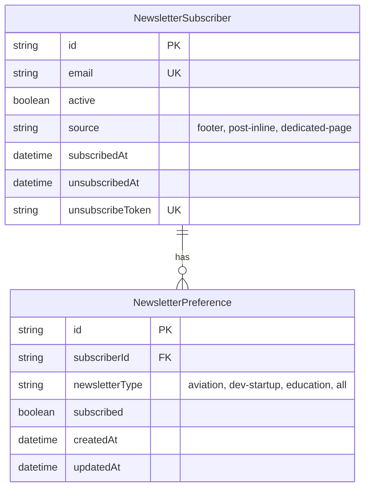
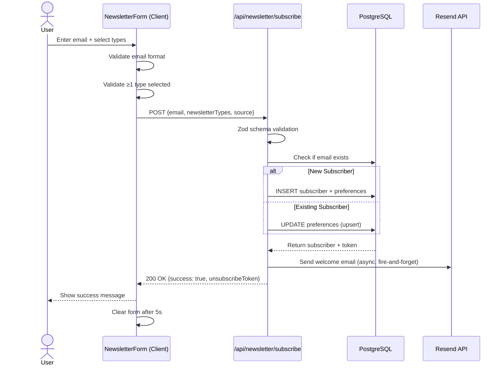

# Data Model: 051-newsletter-signup

## Existing Entities (No Changes Required)

This feature uses existing database schema from Feature 048 (Multi-Track Newsletter). **No new entities or migrations needed.**

### NewsletterSubscriber
**Purpose**: Stores subscriber email, subscription status, and source for analytics

**Fields**:
- `id`: String (PK, cuid) - Unique subscriber identifier
- `email`: String (unique) - Subscriber email address
- `active`: Boolean (default: true) - Subscription status (true = subscribed, false = unsubscribed)
- `source`: String (nullable) - Signup origin ('footer', 'post-inline', 'dedicated-page') for analytics
- `subscribedAt`: DateTime (default: now()) - Timestamp of initial subscription
- `unsubscribedAt`: DateTime (nullable) - Timestamp of unsubscribe (null if active)
- `unsubscribeToken`: String (unique, cuid) - Secure token for one-click unsubscribe (64-char hex)
- `preferences`: NewsletterPreference[] - Relation to preference records

**Relationships**:
- Has many: `NewsletterPreference` (1-to-many via `subscriberId`)

**Validation Rules**:
- `email`: Must be unique, valid email format (from FR-011, Zod schema validation)
- `source`: Optional, one of ['footer', 'post-inline', 'dedicated-page'] (from FR-017)
- `unsubscribeToken`: Auto-generated on creation, unique per subscriber (from FR-014)

**State Transitions**:
- Initial → Active (on creation, `active = true`)
- Active → Unsubscribed (on unsubscribe, `active = false`, `unsubscribedAt = now()`)
- Unsubscribed → Active (on re-subscribe, `active = true`, `unsubscribedAt = null`)

**Indexes**:
- Primary key: `id`
- Unique: `email` (prevents duplicate signups)
- Unique: `unsubscribeToken` (ensures secure, unique unsubscribe links)

---

### NewsletterPreference
**Purpose**: Stores individual newsletter type subscriptions (aviation, dev-startup, education, all)

**Fields**:
- `id`: String (PK, cuid) - Unique preference record identifier
- `subscriberId`: String (FK) - Foreign key to NewsletterSubscriber
- `newsletterType`: String (enum) - One of ['aviation', 'dev-startup', 'education', 'all']
- `subscribed`: Boolean (default: true) - Preference status (true = opted in, false = opted out)
- `createdAt`: DateTime (default: now()) - Timestamp of preference creation
- `updatedAt`: DateTime (auto-update) - Timestamp of last preference update
- `subscriber`: NewsletterSubscriber - Relation to subscriber record

**Relationships**:
- Belongs to: `NewsletterSubscriber` (via `subscriberId` FK, cascade delete)

**Validation Rules**:
- `newsletterType`: Must be one of enum values (from FR-004, Zod schema validation)
- `subscriberId` + `newsletterType`: Composite unique constraint (prevents duplicate preferences per subscriber)

**State Transitions**:
- Initial → Subscribed (on creation, `subscribed = true`)
- Subscribed → Unsubscribed (on preference update, `subscribed = false`)
- Unsubscribed → Subscribed (on preference update, `subscribed = true`)

**Indexes**:
- Primary key: `id`
- Foreign key: `subscriberId` (references NewsletterSubscriber.id)
- Unique: `[subscriberId, newsletterType]` (composite unique constraint)

---

## Database Schema (Prisma)

**Prisma Schema** (from `prisma/schema.prisma` - already deployed):

```prisma
model NewsletterSubscriber {
  id               String                @id @default(cuid())
  email            String                @unique
  active           Boolean               @default(true)
  source           String?
  subscribedAt     DateTime              @default(now())
  unsubscribedAt   DateTime?
  unsubscribeToken String                @unique @default(cuid())
  preferences      NewsletterPreference[]

  @@map("newsletter_subscribers")
}

model NewsletterPreference {
  id             String              @id @default(cuid())
  subscriberId   String
  newsletterType String
  subscribed     Boolean             @default(true)
  createdAt      DateTime            @default(now())
  updatedAt      DateTime            @updatedAt
  subscriber     NewsletterSubscriber @relation(fields: [subscriberId], references: [id], onDelete: Cascade)

  @@unique([subscriberId, newsletterType])
  @@map("newsletter_preferences")
}
```

---

## Entity Relationship Diagram (ERD)



**Cardinality**:
- 1 NewsletterSubscriber → N NewsletterPreference (1-to-many)
- 1 subscriber can have 1-4 preferences (one per newsletter type)
- Cascade delete: Deleting subscriber removes all preferences

---

## API Request/Response Schemas

**Request Schema** (POST /api/newsletter/subscribe):

```typescript
interface NewsletterSubscribeRequest {
  email: string;                    // Valid email format (Zod validation)
  newsletterTypes: NewsletterType[]; // ['aviation', 'dev-startup', 'education', 'all']
  source: string;                    // 'footer', 'post-inline', 'dedicated-page'
}

type NewsletterType = 'aviation' | 'dev-startup' | 'education' | 'all';
```

**Response Schema** (POST /api/newsletter/subscribe):

```typescript
interface NewsletterSubscribeResponse {
  success: boolean;                  // True if subscription succeeded
  message: string;                   // User-friendly message
  data?: {
    unsubscribeToken: string;        // 64-char hex token for unsubscribe link
  };
}
```

**Error Response Schema**:

```typescript
interface NewsletterErrorResponse {
  success: false;
  message: string;                   // User-friendly error message
  error?: string;                    // Technical error details (dev mode only)
}
```

**Example Requests**:

```typescript
// Footer signup (compact form, default to 'all')
POST /api/newsletter/subscribe
{
  "email": "pilot@example.com",
  "newsletterTypes": ["all"],
  "source": "footer"
}

// Inline post signup (aviation post, select aviation + dev)
POST /api/newsletter/subscribe
{
  "email": "developer@example.com",
  "newsletterTypes": ["aviation", "dev-startup"],
  "source": "post-inline"
}

// Dedicated page signup (select all types individually)
POST /api/newsletter/subscribe
{
  "email": "learner@example.com",
  "newsletterTypes": ["aviation", "dev-startup", "education"],
  "source": "dedicated-page"
}
```

---

## Frontend State Shape

**NewsletterSignupForm Component State**:

```typescript
interface FormState {
  email: string;                     // User-entered email address
  newsletterTypes: NewsletterType[]; // Selected newsletter types (1-4)
  loading: boolean;                  // API request in progress
  error: string | null;              // Validation or API error message
  success: boolean;                  // Subscription succeeded
}
```

**Initial State** (default values):

```typescript
const initialState: FormState = {
  email: '',
  newsletterTypes: [],
  loading: false,
  error: null,
  success: false,
};
```

**State Transitions**:
- User types email → Update `email` field
- User checks/unchecks newsletter type → Update `newsletterTypes` array
- User submits form → Set `loading: true`, clear `error`
- API returns success → Set `success: true`, clear form, reset after 5s
- API returns error → Set `error: message`, `loading: false`
- Validation fails → Set `error: message`, `loading: false`

---

## Data Flow Diagram



---

## Migration Plan

**Status**: Not required - schema already exists in production

**Deployed via**: Feature 048 (Multi-Track Newsletter)
- Migration file: `prisma/migrations/XXX_create_newsletter_tables/migration.sql`
- Deployed: 2025-XX-XX (check NOTES.md from feature 048)
- Verified: Existing API routes functional, subscribers in production DB

**If migration were needed** (hypothetical):
1. Create Prisma migration: `npx prisma migrate dev --name add_newsletter_source`
2. Test locally: Verify schema changes, seed test data
3. Deploy to production: `npx prisma migrate deploy` (via GitHub Actions)
4. Verify: Check database schema, test API endpoints

**Rollback Strategy** (if migration existed):
- Prisma supports down migrations via Git revert
- Rollback: `git revert <migration-commit> && npx prisma migrate deploy`
- Data loss: None (additive changes only, no column drops)

---

## Performance Considerations

**Query Optimization**:
- Email lookups: Indexed on `email` (unique constraint creates index automatically)
- Unsubscribe token lookups: Indexed on `unsubscribeToken` (unique constraint)
- Preference updates: Composite unique index on `[subscriberId, newsletterType]` for fast upserts

**Expected Query Performance**:
- Email lookup: <10ms (indexed unique column)
- Insert subscriber + preferences: <50ms (single transaction, 1 subscriber + 1-4 preferences)
- Update preferences: <30ms (composite index lookup + update)

**Capacity Planning**:
- Current scale: <1,000 subscribers (micro tier)
- Target: +100 subscribers in 3 months (spec.md HEART metrics)
- Database impact: Minimal (<1MB data, <100 queries/day)

---

## Security & Privacy

**PII Handling**:
- Only email address stored (minimal PII)
- No names, phone numbers, or other personal data
- Email encrypted at-rest via PostgreSQL AES-256 (Supabase managed)

**GDPR Compliance**:
- Double opt-in: Welcome email confirms subscription
- Unsubscribe: One-click via `unsubscribeToken` in email footer
- Preference management: Update newsletter types via secure link
- Right to deletion: DELETE /api/newsletter/unsubscribe removes all data (cascade)

**Token Security**:
- Unsubscribe tokens: 64-character cuid (cryptographically secure random)
- Unique per subscriber (unique constraint enforced)
- Never logged or exposed in client-side code

---

## Validation Rules Summary

**From Functional Requirements**:
- FR-005: Email format validation (contains '@', Zod regex)
- FR-006: At least 1 newsletter type selected (client + server validation)
- FR-011: API validates email + newsletterTypes (Zod schema)
- FR-012: API handles 400 (validation), 429 (rate limit), 500 (server error)

**Zod Schemas** (from lib/newsletter/validation-schemas.ts):

```typescript
import { z } from 'zod';

export const NewsletterTypeSchema = z.enum([
  'aviation',
  'dev-startup',
  'education',
  'all',
]);

export const NewsletterSubscribeSchema = z.object({
  email: z.string().email('Invalid email format'),
  newsletterTypes: z.array(NewsletterTypeSchema).min(1, 'Select at least one newsletter'),
  source: z.string().optional(),
});

export type NewsletterType = z.infer<typeof NewsletterTypeSchema>;
export type NewsletterSubscribeInput = z.infer<typeof NewsletterSubscribeSchema>;
```

---

## Contracts

**API Contract**: See `contracts/api.yaml` (OpenAPI spec - to be created if needed)

**Frontend Contract**: NewsletterSignupForm props

```typescript
interface NewsletterSignupFormProps {
  source?: string;                   // Analytics source ('footer', 'post-inline', 'dedicated-page')
  variant?: 'compact' | 'inline' | 'comprehensive'; // UI variant (default: 'comprehensive')
  className?: string;                // Additional Tailwind classes
}
```

**Component Interface** (public API):
- Input: `email` (text input), `newsletterTypes` (checkboxes)
- Output: Success message or error message
- Side effects: API call to POST /api/newsletter/subscribe, GA4 event tracking
