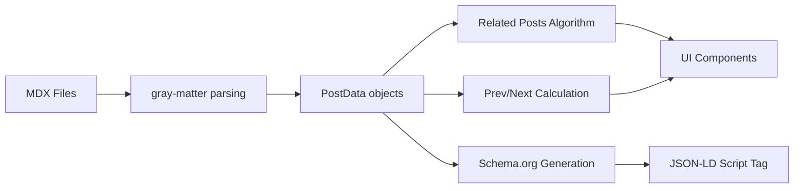

# Data Model: individual-post-page

## Entities

### RelatedPost (Derived from PostData)
**Purpose**: Represent a blog post with relevance score for related posts recommendations

**Fields**:
- Inherits all fields from `PostData` type (lib/mdx-types.ts)
- `relevanceScore`: number - Count of shared tags with current post (higher = more relevant)

**Relationships**:
- Derived from: PostData (existing type)
- Source: Current post's tags compared against all other posts' tags

**Validation Rules**:
- `relevanceScore`: Must be integer ≥ 0 (from requirement FR-001)
- Posts with score = 0 are excluded from related posts
- If <3 posts with score >0, fall back to latest posts (from edge case handling)

**Sorting**:
- Primary: relevanceScore DESC (highest overlap first)
- Secondary: date DESC (newest first for ties)
- Limit: 3 posts (from requirement FR-007)

---

### TOCHeading (Client-side)
**Purpose**: Represent a heading extracted from MDX content for table of contents

**Fields**:
- `id`: string - Generated slug for anchor link (e.g., "introduction")
- `text`: string - Heading text content
- `level`: 2 | 3 - Heading level (H2 or H3, excludes H1)
- `slug`: string - URL-safe version of text (for hash navigation)
- `top`: number - Scroll position in pixels (for active section detection)

**Relationships**:
- Extracted from: DOM querySelectorAll('h2, h3') after MDX render
- Parent: None (flat list, indentation handled by CSS)

**Validation Rules**:
- Minimum 3 headings required to display TOC (from requirement FR-009)
- `level`: Must be 2 or 3 only (H1 is post title, excluded)
- `slug`: Generated from text using kebab-case transformation

**State Transitions**:
- Inactive → Active (when heading scrolls into view)
- Active → Inactive (when different heading enters view)

---

### BreadcrumbSegment (Derived)
**Purpose**: Navigation path element for breadcrumb trail

**Fields**:
- `label`: string - Display text (e.g., "Home", "Blog", "Aviation", "Post Title")
- `url`: string - Navigation URL (e.g., "/", "/blog", "/blog/tag/aviation")
- `position`: number - Position in breadcrumb trail (1-indexed for schema.org)

**Relationships**:
- Parent: None (linear trail)
- Source: URL params (from query string ?from=tag/aviation)

**Validation Rules**:
- First segment always "Home" with position 1
- Second segment always "Blog" with position 2
- Optional tag segment at position 3 (if ?from=tag/[tag-slug])
- Last segment always current post title (truncated to 60 chars if needed)

---

### BlogPostingSchema (Schema.org JSON-LD)
**Purpose**: Structured data for search engine rich snippets

**Fields** (maps to PostData):
- `@type`: "BlogPosting" (constant)
- `headline`: PostData.frontmatter.title
- `datePublished`: PostData.frontmatter.date
- `dateModified`: PostData.frontmatter.date (same as published for now)
- `author`: { @type: "Person", name: PostData.frontmatter.author, url: "https://marcusgoll.com" }
- `image`: PostData.frontmatter.featuredImage || "/images/og-default.png"
- `articleBody`: PostData.content (plain text, stripped of MDX)
- `wordCount`: Calculated from content length
- `description`: PostData.frontmatter.excerpt
- `publisher`: { @type: "Organization", name: "Marcus Gollahon", logo: {...} }

**Relationships**:
- Source: PostData from getPostBySlug()
- Validation: Must pass Google Rich Results Test (from requirement FR-003, US3)

**Additional Schema**:
- BreadcrumbList schema embedded in same component (for breadcrumbs)

---

## Database Schema (N/A - File-based Content)

This feature uses file-based MDX content (content/posts/*.mdx), not a database.

**Data flow**:


**No database migrations required** - all data computed at build time from filesystem.

---

## API Schemas (N/A - Server Components)

This feature uses Next.js Server Components with direct file system access. No REST/GraphQL API endpoints required.

**Data fetching pattern**:
- Server Component: `await getAllPosts()` (direct function call)
- Client Component: Props passed from Server Component parent

---

## State Shape (Frontend)

**Related Posts Component** (Server Component - no client state):
```typescript
interface RelatedPostsProps {
  currentSlug: string;
  limit?: number;
}

// Internal derived state (computed server-side)
interface RelatedPost extends PostData {
  relevanceScore: number; // Tag overlap count
}
```

**Table of Contents Component** (Client Component):
```typescript
interface TableOfContentsState {
  headings: TOCHeading[];
  activeId: string | null;
  isCollapsed: boolean; // Mobile only
}

interface TOCHeading {
  id: string;
  text: string;
  level: 2 | 3;
  slug: string;
  top: number; // Scroll position
}
```

**Social Share Component** (Client Component):
```typescript
interface SocialShareState {
  copied: boolean; // Clipboard feedback
  shareUrl: string;
  shareTitle: string;
}
```

**Prev/Next Navigation** (Server Component - no client state):
```typescript
interface PrevNextNavProps {
  prevPost: PostData | null;
  nextPost: PostData | null;
}
```

**Breadcrumbs** (Server Component - derives from URL):
```typescript
interface BreadcrumbsProps {
  currentPost: PostData;
  fromTag?: string; // Optional query param
}
```

---

## Performance Considerations

**Build-time Computation** (Static Generation):
- Related posts calculated during `generateStaticParams()` for each post
- Prev/Next links computed once per post at build time
- Schema.org JSON generated server-side (no runtime cost)

**Client-side Computation** (Runtime):
- TOC extraction: O(n) where n = number of headings (typically <20)
- Scroll spy: Throttled intersection observer (60fps max)
- Social share: Synchronous clipboard API (<1ms)

**Memory Footprint**:
- TOC state: ~2KB per post (10-20 headings × 100 bytes)
- Related posts: No client state (rendered server-side)
- Total client-side state: <5KB

