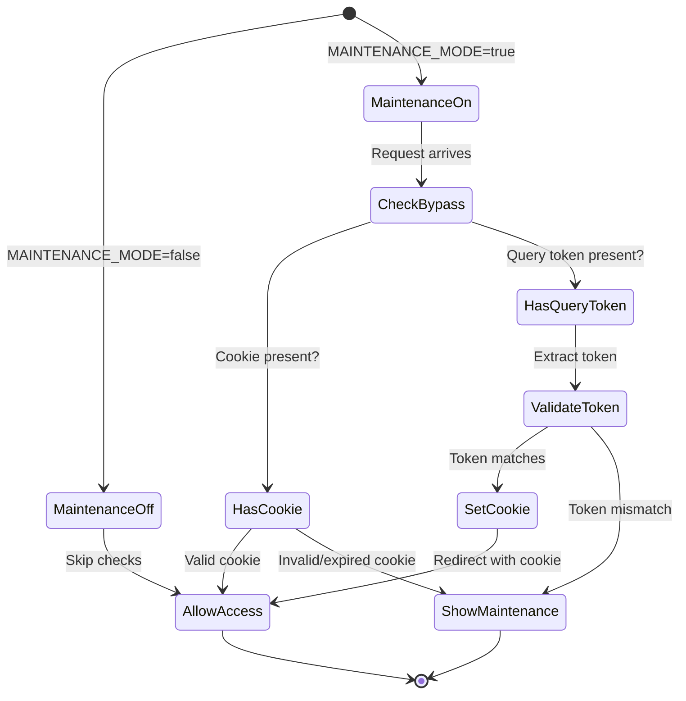
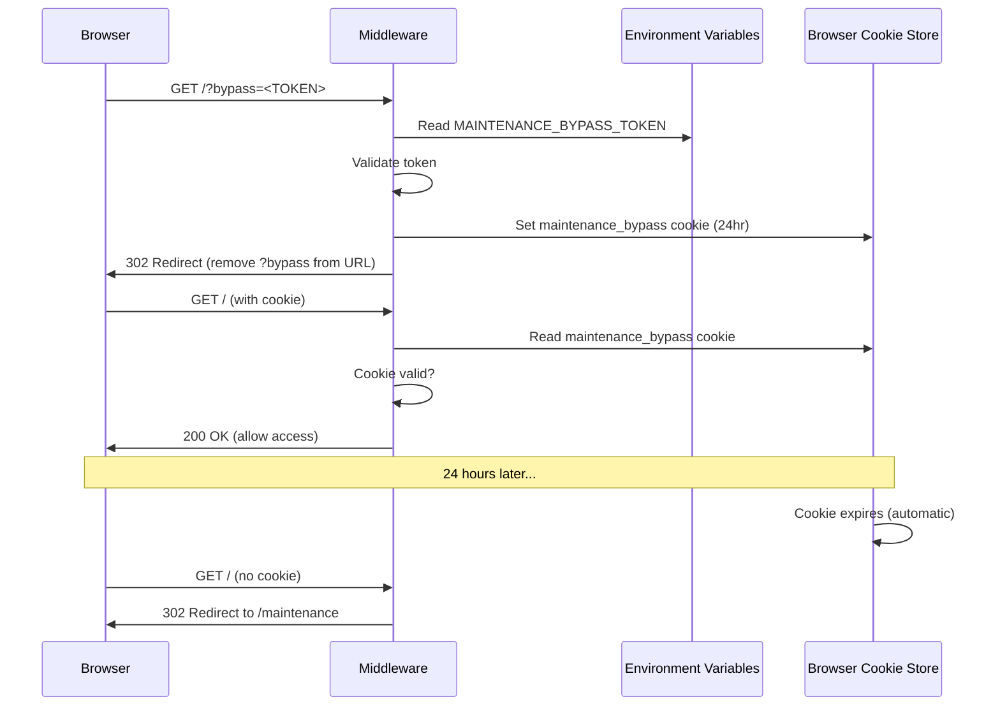

# Data Model: maintenance-mode-byp

**Note**: This feature has no persistent data storage requirements. All state is ephemeral (environment variables, cookies, in-memory checks).

---

## State Management

### Runtime State (Environment Variables)

**MAINTENANCE_MODE**
- **Type**: String ("true" | "false")
- **Default**: "false"
- **Scope**: Server-side only (process.env)
- **Purpose**: Toggle maintenance mode on/off without code deployment
- **Validation**: Case-insensitive boolean check
- **Source**: Platform environment variable configuration (Vercel, Railway, etc.)

**MAINTENANCE_BYPASS_TOKEN**
- **Type**: String (64-character hexadecimal)
- **Format**: `[0-9a-f]{64}` (regex validation)
- **Scope**: Server-side only (process.env, never exposed to client)
- **Purpose**: Secret token for developer bypass authentication
- **Generation**: `openssl rand -hex 32`
- **Security**: 256-bit entropy (2^256 combinations)
- **Rotation**: Manual (regenerate and update env var when compromised)

---

### Session State (HTTP Cookies)

**maintenance_bypass**
- **Purpose**: Persistent bypass authentication after successful token validation
- **Value**: "true" (or hashed token for extra security)
- **Expiration**: 24 hours from creation
- **Domain**: Current domain (auto-set by browser)
- **Path**: "/" (site-wide)
- **Flags**:
  - `HttpOnly: true` - Prevents JavaScript access (XSS protection)
  - `Secure: true` - HTTPS-only transmission (MITM protection)
  - `SameSite: Strict` - Prevents CSRF attacks
- **Storage**: Browser cookie store (client-side, secure)
- **Lifecycle**:
  1. Created: After successful token validation
  2. Read: On every request by middleware
  3. Deleted: After 24 hours (automatic expiration) or manual browser clear

---

## Request State (Per-Request Processing)

### Middleware Processing State

**Per-Request Variables** (in-memory, not persisted):

```typescript
interface MaintenanceRequestState {
  // Request metadata
  pathname: string;           // Current URL path (e.g., "/blog")
  searchParams: URLSearchParams; // Query parameters

  // Maintenance mode checks
  isMaintenanceMode: boolean; // MAINTENANCE_MODE === "true"
  isExcludedPath: boolean;    // Path matches exclusion pattern

  // Bypass authentication
  bypassTokenInQuery: string | null; // ?bypass=<TOKEN>
  bypassCookie: string | null;       // Cookie: maintenance_bypass=true
  isValidBypass: boolean;            // Token matches env var

  // Logging metadata
  timestamp: string;          // ISO 8601 timestamp
  ipAddress: string;          // Request IP (for failed bypass logging)
  userAgent: string;          // Browser user agent
}
```

**Lifecycle**: Created at request start, processed, discarded after response sent

---

## Data Flows

### Flow 1: External Visitor (No Bypass)

```
1. Request arrives → Middleware intercepts
2. Check pathname → Not excluded
3. Check MAINTENANCE_MODE → "true"
4. Check bypass cookie → Not present
5. Check query parameter → No ?bypass=<TOKEN>
6. Redirect to /maintenance
7. Serve maintenance page
```

**State Changes**: None (no cookies set, no data persisted)

---

### Flow 2: Developer Bypass (First Time)

```
1. Request arrives with ?bypass=<TOKEN>
2. Middleware intercepts
3. Check MAINTENANCE_MODE → "true"
4. Check bypass cookie → Not present
5. Extract token from query parameter
6. Validate token against MAINTENANCE_BYPASS_TOKEN env var
7. Token matches → Set maintenance_bypass cookie (24hr expiration)
8. Log successful bypass (masked token)
9. Redirect to same URL (without ?bypass parameter)
10. Browser requests again with cookie
11. Cookie present → Allow normal access
```

**State Changes**:
- Cookie created: `maintenance_bypass=true; HttpOnly; Secure; SameSite=Strict; Max-Age=86400`
- Log entry: `[INFO] Maintenance Bypass: Successful - Token: ***<last 4 chars> - IP: <ip>`

---

### Flow 3: Developer Navigation (Bypass Active)

```
1. Request arrives with maintenance_bypass cookie
2. Middleware intercepts
3. Check MAINTENANCE_MODE → "true"
4. Check bypass cookie → Present and valid
5. Allow request (skip maintenance logic)
6. Serve requested page normally
```

**State Changes**: None (cookie persists, no new logs)

---

### Flow 4: Failed Bypass Attempt

```
1. Request arrives with ?bypass=WRONG_TOKEN
2. Middleware intercepts
3. Check MAINTENANCE_MODE → "true"
4. Check bypass cookie → Not present
5. Extract token from query parameter
6. Validate token → Mismatch
7. Log failed bypass attempt (masked token, IP address)
8. Redirect to /maintenance (no cookie set)
```

**State Changes**:
- Log entry: `[WARN] Maintenance Bypass: Failed - Token: ***<last 4 chars> - IP: <ip>`

---

### Flow 5: Maintenance Mode Disabled

```
1. Admin updates MAINTENANCE_MODE → "false" in platform UI
2. Next request arrives
3. Middleware intercepts
4. Check MAINTENANCE_MODE → "false"
5. Skip all maintenance logic (early return)
6. Allow request to proceed normally
```

**State Changes**: None (cookies remain but are ignored, no active checking)

---

## Schema Diagrams

### State Transition Diagram



### Cookie Lifecycle



---

## API Schemas

### Environment Variable Schema

```typescript
/**
 * Maintenance Mode Environment Variables
 * Add to lib/env-schema.ts
 */
interface MaintenanceEnvVars {
  /**
   * Maintenance mode toggle
   * @required No (default: "false")
   * @format "true" | "false" (case-insensitive)
   * @purpose Enable/disable maintenance mode without code deployment
   */
  MAINTENANCE_MODE?: string;

  /**
   * Bypass token for developer access
   * @required Only when MAINTENANCE_MODE=true
   * @format 64-character hexadecimal string
   * @security KEEP SECRET - allows bypassing maintenance mode
   * @generation openssl rand -hex 32
   */
  MAINTENANCE_BYPASS_TOKEN?: string;
}
```

### Cookie Schema

```typescript
/**
 * Maintenance Bypass Cookie Configuration
 */
interface MaintenanceBypassCookie {
  name: 'maintenance_bypass';
  value: 'true';
  options: {
    httpOnly: true;         // Prevents XSS
    secure: true;           // HTTPS-only
    sameSite: 'strict';     // Prevents CSRF
    maxAge: 86400;          // 24 hours in seconds
    path: '/';              // Site-wide
  };
}
```

### Middleware Configuration Schema

```typescript
/**
 * Middleware Matcher Configuration
 */
export const config = {
  matcher: [
    /*
     * Match all paths EXCEPT:
     * - _next (Next.js internals)
     * - images, fonts (static assets)
     * - api/health (health checks)
     * - maintenance (prevents redirect loop)
     */
    '/((?!_next|images|fonts|api/health|maintenance).*)',
  ],
};
```

---

## Validation Rules

### Token Validation
- **Format**: 64 hexadecimal characters (0-9, a-f)
- **Case-sensitivity**: Case-sensitive match
- **Validation**: Exact string equality with MAINTENANCE_BYPASS_TOKEN env var
- **Rejection**: Any mismatch, empty string, or malformed token

### Cookie Validation
- **Presence**: Cookie exists and has non-empty value
- **Expiration**: Browser handles (middleware receives expired cookies as absent)
- **Value**: "true" (or hashed token if enhanced security needed)

### Path Exclusion Validation
- **Static Assets**: `/_next/*`, `/images/*`, `/fonts/*`
- **API Endpoints**: `/api/health`
- **Self-Reference**: `/maintenance`
- **Implementation**: Regex pattern matching (compiled at startup)

---

## Performance Considerations

### Memory Footprint
- **Middleware State**: <1 KB per request (ephemeral, garbage collected)
- **Cookie Size**: ~20 bytes (name + value + flags)
- **Log Size**: ~150 bytes per bypass attempt

### Processing Time
- **Token Validation**: <1ms (string comparison)
- **Cookie Parsing**: <1ms (built-in Next.js API)
- **Path Checking**: <1ms (regex match)
- **Total Overhead**: <5ms per request (well within <10ms target)

---

## Security Considerations

### Data Protection
- **Token Storage**: Environment variable only (never logged in full, never in database)
- **Token Transmission**: HTTPS-only (Secure cookie flag)
- **Token Logging**: Masked except last 4 characters
- **Cookie Protection**: HttpOnly (no JS access), SameSite=Strict (no CSRF)

### Attack Surface
- **Brute Force**: Infeasible (2^256 entropy, 24hr window)
- **Token Leakage**: Mitigated by URL removal after validation
- **XSS**: Mitigated by HttpOnly cookie flag
- **MITM**: Mitigated by Secure cookie flag and HTTPS
- **CSRF**: Mitigated by SameSite=Strict

---

## Migration Requirements

**None** - This feature requires no database migrations, schema changes, or data seeding.

---

## Rollback Considerations

**State Cleanup**:
- Cookie expires automatically after 24 hours
- Environment variables can be removed if feature is rolled back
- No persistent data to clean up

**Rollback Steps**:
1. Remove environment variables (MAINTENANCE_MODE, MAINTENANCE_BYPASS_TOKEN)
2. Revert code (delete middleware.ts, app/maintenance/page.tsx)
3. Deploy rollback
4. Cookies expire automatically (no manual cleanup needed)

---

## Summary

**Data Storage**: Zero persistent storage
**Runtime State**: 2 environment variables
**Session State**: 1 HTTP cookie (24-hour expiration)
**Processing State**: In-memory per-request (ephemeral)
**Performance**: <5ms overhead per request
**Security**: Cryptographically secure, defense-in-depth

This is a stateless, lightweight feature with minimal data footprint and excellent security posture.
