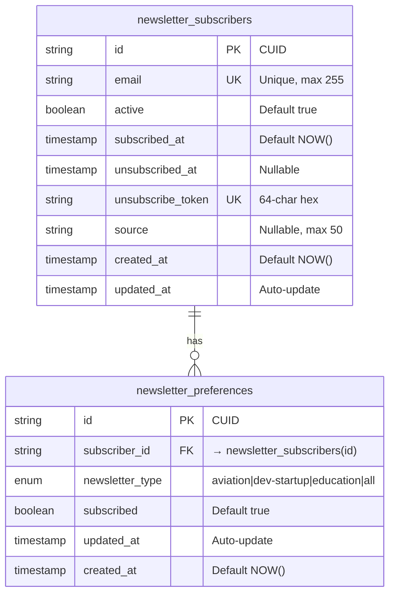

# Data Model: Multi-Track Newsletter

## Entities

### NewsletterSubscriber

**Purpose**: Store subscriber email and global subscription status

**Fields**:
- `id`: String (CUID) - Primary key, auto-generated
- `email`: String (255 chars) - Subscriber email address, unique
- `active`: Boolean - Global subscription status (true=subscribed, false=unsubscribed from all)
- `subscribed_at`: Timestamp - Initial signup date
- `unsubscribed_at`: Timestamp (nullable) - Full unsubscribe date (when active=false)
- `unsubscribe_token`: String (64 chars) - Secure hex token for preference/unsubscribe links, unique
- `source`: String (50 chars, nullable) - Signup source (footer, popup, post-cta)
- `created_at`: Timestamp - Record creation (system-managed)
- `updated_at`: Timestamp - Last modified (system-managed)

**Relationships**:
- Has many: NewsletterPreference (one subscriber can have multiple newsletter preferences)

**Validation Rules**:
- `email`: RFC 5322 format, unique across table (from requirement FR-002)
- `unsubscribe_token`: 64-character hex string (32 random bytes), unique (from requirement FR-004)
- `active`: If false, `unsubscribed_at` must be set
- `source`: Max 50 characters, nullable

**State Transitions**:
- New signup → active=true, subscribed_at=NOW(), token generated
- Unsubscribe from all → active=false, unsubscribed_at=NOW(), preferences all set to false
- Re-subscribe → active=true, unsubscribed_at=NULL
- Hard delete (GDPR) → Record deleted with CASCADE to preferences

**Indexes**:
- `newsletter_email_idx` ON (email) - Unique constraint, fast lookup for upsert
- `newsletter_active_idx` ON (active) - Query active subscribers efficiently
- `newsletter_token_idx` ON (unsubscribe_token) - One-click unsubscribe link lookup

---

### NewsletterPreference

**Purpose**: Track which specific newsletters each subscriber wants to receive

**Fields**:
- `id`: String (CUID) - Primary key, auto-generated
- `subscriber_id`: String (CUID) - Foreign key to NewsletterSubscriber.id
- `newsletter_type`: ENUM('aviation', 'dev-startup', 'education', 'all') - Newsletter category
- `subscribed`: Boolean - Opted in/out for this specific newsletter
- `updated_at`: Timestamp - Last preference change
- `created_at`: Timestamp - Record creation (system-managed)

**Relationships**:
- Belongs to: NewsletterSubscriber (many preferences belong to one subscriber)

**Constraints**:
- UNIQUE(subscriber_id, newsletter_type) - One preference row per subscriber per newsletter type
- CHECK: newsletter_type IN ('aviation', 'dev-startup', 'education', 'all')

**Validation Rules**:
- `subscriber_id`: Must reference existing NewsletterSubscriber (foreign key constraint)
- `newsletter_type`: Must be valid enum value (from requirement FR-001)
- `subscribed`: Boolean, not null

**Business Rules**:
- At least one preference must have `subscribed=true` per subscriber (enforced at API level, not DB constraint)
- When subscriber.active=false, all preferences should have `subscribed=false` (enforced by unsubscribe API)
- Preferences are created during signup for selected newsletter types
- Preferences are updated (not deleted) when user changes selections

**Indexes**:
- `newsletter_pref_subscriber_idx` ON (subscriber_id) - Query all preferences for a subscriber
- `newsletter_pref_type_idx` ON (newsletter_type, subscribed) - Count subscribers per newsletter type

---

## Database Schema (Mermaid)



---

## API Schemas

**Request/Response Schemas**: See contracts/api.yaml

**Newsletter Type ENUM**:
```typescript
enum NewsletterType {
  AVIATION = 'aviation',
  DEV_STARTUP = 'dev-startup',
  EDUCATION = 'education',
  ALL = 'all'
}
```

**State Shape** (frontend):
```typescript
// Signup form state
interface SignupFormState {
  email: string
  newsletterTypes: NewsletterType[]
  loading: boolean
  error: string | null
  success: boolean
}

// Preference management state
interface PreferenceState {
  email: string // Read-only
  preferences: {
    aviation: boolean
    'dev-startup': boolean
    education: boolean
    all: boolean
  }
  loading: boolean
  error: string | null
  success: boolean
}

// Subscriber entity (from database)
interface Subscriber {
  id: string
  email: string
  active: boolean
  subscribedAt: Date
  unsubscribedAt: Date | null
  unsubscribeToken: string
  source: string | null
}

// Preference entity (from database)
interface Preference {
  id: string
  subscriberId: string
  newsletterType: NewsletterType
  subscribed: boolean
  updatedAt: Date
}
```

---

## Prisma Schema Definition

```prisma
// Newsletter subscriber model
model NewsletterSubscriber {
  id                String   @id @default(cuid())
  email             String   @unique
  active            Boolean  @default(true)
  subscribedAt      DateTime @default(now())
  unsubscribedAt    DateTime?
  unsubscribeToken  String   @unique @db.VarChar(64)
  source            String?  @db.VarChar(50)
  createdAt         DateTime @default(now())
  updatedAt         DateTime @updatedAt

  preferences       NewsletterPreference[]

  @@map("newsletter_subscribers")
  @@index([email])
  @@index([active])
  @@index([unsubscribeToken])
}

// Newsletter preference model (which newsletters user wants)
model NewsletterPreference {
  id             String   @id @default(cuid())
  subscriberId   String
  newsletterType String   @db.VarChar(50) // aviation, dev-startup, education, all
  subscribed     Boolean  @default(true)
  updatedAt      DateTime @updatedAt
  createdAt      DateTime @default(now())

  subscriber     NewsletterSubscriber @relation(fields: [subscriberId], references: [id], onDelete: Cascade)

  @@unique([subscriberId, newsletterType])
  @@map("newsletter_preferences")
  @@index([subscriberId])
  @@index([newsletterType, subscribed])
}
```

**Migration Required**: Yes - Create both tables with indexes and constraints
**Reversible**: Yes - Can drop tables without affecting existing User model