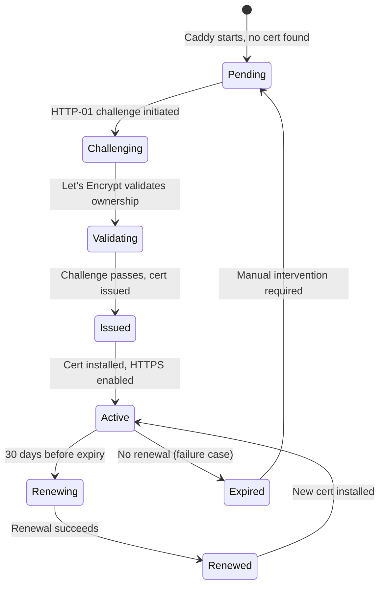

# Data Model: 048-ssl-tls-letsencrypt

## Overview

**Infrastructure Feature**: SSL/TLS with Let's Encrypt does not introduce new database entities or API schemas. This feature operates at the infrastructure layer (Caddy reverse proxy) and is transparent to the application.

**Data Stored**:
- SSL/TLS certificates (file-based, stored in Docker volume)
- Certificate metadata (Let's Encrypt ACME state)
- Renewal state (timestamps, next renewal date)

**Storage Location**: Docker volume `caddy-data` mounted at `/data/caddy` in Caddy container

---

## Certificate Storage Structure

### Directory Layout

**Caddy Data Volume** (`/data/caddy`):
```
/data/caddy/
├── acme/
│   ├── acme-v02.api.letsencrypt.org-directory/
│   │   ├── users/
│   │   │   └── marcusgoll@gmail.com/
│   │   │       ├── <account-id>.json  # ACME account credentials
│   │   │       └── <account-id>.key   # ACME account private key
│   │   └── certificates/
│   │       ├── marcusgoll.com/
│   │       │   ├── marcusgoll.com.crt      # Certificate (PEM)
│   │       │   ├── marcusgoll.com.key      # Private key (PEM)
│   │       │   ├── marcusgoll.com.json     # Metadata (expiry, SANs)
│   │       │   └── marcusgoll.com.issuer.crt # Intermediate cert
│   │       ├── cfipros.com/
│   │       │   ├── cfipros.com.crt
│   │       │   ├── cfipros.com.key
│   │       │   ├── cfipros.com.json
│   │       │   └── cfipros.com.issuer.crt
│   │       ├── ghost.marcusgoll.com/
│   │       └── api.marcusgoll.com/
└── locks/  # File locks for concurrent Caddy instances
```

**Permissions**:
- Certificates: 0600 (owner read/write only)
- Private keys: 0600 (owner read/write only)
- Directories: 0700 (owner access only)

**Owner**: Caddy process user (typically `caddy` or `root` in container)

---

## Certificate Metadata

### Certificate JSON Schema

**File**: `/data/caddy/acme/.../certificates/<domain>/<domain>.json`

**Example** (`marcusgoll.com.json`):
```json
{
  "domain": "marcusgoll.com",
  "certUrl": "https://acme-v02.api.letsencrypt.org/acme/cert/...",
  "certStableUrl": "https://acme-v02.api.letsencrypt.org/acme/cert/...",
  "privateKey": "<base64-encoded-private-key>",
  "certificate": "<base64-encoded-certificate>",
  "issuerCertificate": "<base64-encoded-intermediate-cert>",
  "names": [
    "marcusgoll.com"
  ],
  "notBefore": "2025-10-28T00:00:00Z",
  "notAfter": "2026-01-26T00:00:00Z"
}
```

**Key Fields**:
- `domain`: Primary domain name
- `names`: All SANs (Subject Alternative Names) covered by cert
- `notBefore`: Certificate valid start date
- `notAfter`: Expiry date (90 days from issuance)
- `certUrl`: Let's Encrypt certificate URL (for renewal)

**Usage**:
- Caddy reads this on startup to determine if renewal needed
- Renewal triggered if `notAfter - 30 days < current_time`

---

## ACME Account

### Account JSON Schema

**File**: `/data/caddy/acme/.../users/marcusgoll@gmail.com/<account-id>.json`

**Example**:
```json
{
  "email": "marcusgoll@gmail.com",
  "registration": {
    "body": {
      "status": "valid",
      "contact": [
        "mailto:marcusgoll@gmail.com"
      ]
    },
    "uri": "https://acme-v02.api.letsencrypt.org/acme/acct/...",
    "newNonce": "",
    "termsOfService": "https://letsencrypt.org/documents/LE-SA-v1.3-September-21-2022.pdf",
    "authorizations": ""
  }
}
```

**Key Fields**:
- `email`: Contact email for expiry notifications
- `uri`: ACME account URI (permanent identifier)
- `status`: Account status (valid/revoked/deactivated)

**Usage**:
- Caddy uses this account to request/renew certificates
- One account per email address per ACME provider

---

## State Transitions

### Certificate Lifecycle



**State Definitions**:
- **Pending**: Certificate does not exist, HTTPS unavailable
- **Challenging**: HTTP-01 challenge in progress (/.well-known/acme-challenge/)
- **Validating**: Let's Encrypt verifying domain ownership
- **Issued**: Certificate issued by Let's Encrypt
- **Active**: Certificate installed, HTTPS serving traffic
- **Renewing**: Automatic renewal process initiated (30 days before expiry)
- **Renewed**: New certificate issued
- **Expired**: Certificate expired (renewal failed repeatedly)

---

## Validation Rules

### Certificate Requirements

**From Let's Encrypt**:
- Domain must resolve to VPS IP address (A record)
- HTTP port 80 accessible from internet (for HTTP-01 challenge)
- Domain not on Let's Encrypt block list
- Rate limits not exceeded (50 certs/domain/week)

**From spec.md FR-001**:
- DNS points to VPS IP before Caddy deployment
- Validated via deployment checklist (US4)

### Volume Persistence Requirements

**From spec.md FR-002**:
- Volume must persist across container restarts
- Volume must survive Docker Compose down/up
- Volume must be backed up (NFR-004)

**Validation**:
- Check volume exists: `docker volume ls | grep caddy-data`
- Check mount point: `docker inspect marcusgoll-caddy | grep /data/caddy`

---

## Backup Strategy

### Certificate Backup

**Frequency**: Daily (part of VPS backup strategy per NFR-004)

**Backup Contents**:
- Entire `/data/caddy` volume
- Includes certificates, private keys, ACME state

**Backup Methods**:
- Docker volume backup: `docker run --rm -v caddy-data:/data -v /backup:/backup alpine tar czf /backup/caddy-data-$(date +%F).tar.gz /data`
- VPS filesystem backup: Include volume mount point in automated backups

**Retention**: 7 days (sufficient for 90-day cert validity)

**Restore**:
```bash
# Stop Caddy
docker-compose -f docker-compose.prod.yml stop caddy

# Restore volume
docker run --rm -v caddy-data:/data -v /backup:/backup alpine sh -c "cd /data && tar xzf /backup/caddy-data-YYYY-MM-DD.tar.gz --strip 1"

# Restart Caddy
docker-compose -f docker-compose.prod.yml up -d caddy
```

---

## Security Considerations

### Private Key Protection

**Requirement**: Private keys must never leave VPS

**Implementation**:
- Keys stored only in Docker volume (not in Git)
- Volume not exposed to host filesystem (Docker-managed)
- Container runs as non-root user (Caddy official image default)
- File permissions 0600 (owner read/write only)

**Violations to Prevent**:
- ❌ Committing certificates or keys to Git
- ❌ Copying keys to local development machine
- ❌ Sending keys via email or insecure channels
- ❌ Exposing keys in logs or environment variables

### Certificate Rotation

**Automatic**: Let's Encrypt certificates auto-renew every 60 days (30 days before 90-day expiry)

**Manual** (if needed):
```bash
# Force certificate renewal
docker exec marcusgoll-caddy caddy reload --config /etc/caddy/Caddyfile --force
```

**No manual rotation needed** for normal operations. Automatic renewal handles everything.

---

## Monitoring Data

### Certificate Expiry

**Source**: Caddy logs + certificate metadata JSON

**Metrics to Track** (Priority 2 - US5):
- Days until expiry: `notAfter - current_time`
- Last renewal attempt: Caddy log timestamp
- Renewal success/failure: Log event parsing

**Alert Thresholds** (Future):
- Warning: <30 days until expiry (renewal should have happened)
- Critical: <14 days until expiry (manual intervention required)

**Implementation**: Deferred to Priority 2 (enhancement phase)

---

## No Database Entities

**No Prisma models needed**: This feature operates entirely at the infrastructure layer. No application database changes required.

**No API schemas needed**: Certificates are managed by Caddy, not exposed via API. Application is unaware of SSL/TLS implementation details.

---

## References

- Caddy ACME documentation: https://caddyserver.com/docs/automatic-https
- Let's Encrypt certificate format: X.509 PEM-encoded
- Docker volume documentation: https://docs.docker.com/storage/volumes/
