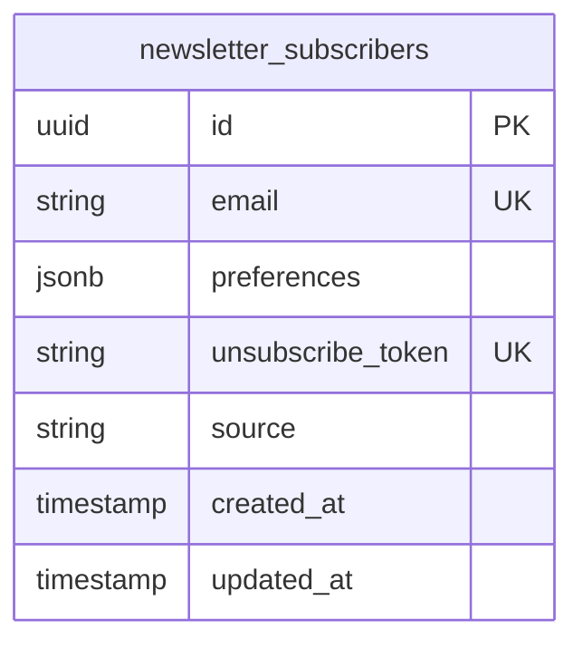

# Data Model: 055-homepage-redesign

**No Database Schema Changes Required** - UI-only feature

## Entities

### Post (MDX Frontmatter)

**Purpose**: Blog post metadata extracted from MDX files

**Source**: `content/posts/*.mdx` files (filesystem, not database)

**Fields**:
- `title`: string - Post title
- `slug`: string - URL-friendly identifier (e.g., "systematic-thinking")
- `excerpt`: string - Brief summary (140-160 chars)
- `feature_image`: string (URL) - Featured image path
- `published_at`: string (ISO date) - Publication date (e.g., "2025-10-15T10:00:00Z")
- `tags`: string[] - Content tracks (aviation | dev-startup | cross-pollination)
- `reading_time`: number - Calculated reading time in minutes
- `featured`: boolean - **NEW** Flag for featured posts showcase (default: false)
- `primary_author`: object - Author metadata
  - `name`: string - Author name (Marcus Gollahon)

**Validation Rules**:
- `title`: Required, <100 chars (from requirement FR-006)
- `slug`: Required, unique, lowercase, hyphenated
- `excerpt`: Required if displaying in post cards (from requirement FR-006)
- `tags`: At least 1 tag required (aviation, dev-startup, or cross-pollination)
- `featured`: Optional, boolean (defaults to false if not present)

**State Transitions**: N/A (static content, no lifecycle)

**Example Frontmatter**:
```yaml
---
title: "Systematic Thinking from the Cockpit"
slug: "systematic-thinking-cockpit"
excerpt: "How aviation's checklist mentality applies to software engineering."
feature_image: "/images/posts/cockpit.jpg"
published_at: "2025-10-15T10:00:00Z"
tags: ["aviation", "cross-pollination"]
featured: true
primary_author:
  name: "Marcus Gollahon"
---
```

---

### Project (Hardcoded/Config)

**Purpose**: Showcase current startup project on homepage

**Source**: Hardcoded in component or config file (no database)

**Fields**:
- `name`: string - Project name (e.g., "CFIPros.com")
- `tagline`: string - Brief description (<100 chars)
- `status`: enum - 'active' | 'shipped' | 'paused'
- `url`: string - External project URL
- `description`: string - Longer description (1-2 sentences)
- `cta_text`: string - Call-to-action button text (e.g., "Visit Project", "Read Build Log")
- `cta_url`: string - CTA destination URL

**Validation Rules**:
- `status`: Only render on homepage when status === 'active' (from requirement FR-008)
- `url`: Valid URL format (starts with http:// or https://)
- `tagline`: <100 chars for UI consistency

**State Transitions**:
- Active → Shipped (when project launches)
- Active → Paused (when development paused)
- Paused → Active (when resumed)

**Example (Hardcoded)**:
```typescript
const currentProject: Project = {
  name: "CFIPros.com",
  tagline: "Aviation training platform for flight instructors",
  status: "active",
  url: "https://cfipros.com",
  description: "Building a modern platform for CFIs to manage students, track progress, and streamline training operations.",
  cta_text: "Visit Project",
  cta_url: "https://cfipros.com"
};
```

---

### NewsletterSubscriber (Existing Prisma Model)

**Purpose**: Store newsletter subscribers with multi-track preferences

**Source**: PostgreSQL database (Supabase, self-hosted)

**Table**: `newsletter_subscribers`

**Fields** (existing schema, no changes):
- `id`: UUID (PK) - Unique subscriber ID
- `email`: string (unique) - Subscriber email address
- `preferences`: JSONB - Newsletter type preferences
  - `aviation`: boolean - Subscribe to aviation posts
  - `dev-startup`: boolean - Subscribe to dev/startup posts
  - `education`: boolean - Subscribe to education posts
  - `all`: boolean - Subscribe to all content
- `unsubscribe_token`: string (unique) - Token for preference management and unsubscribe
- `source`: string - Signup source (e.g., "homepage-hero", "homepage-section")
- `created_at`: Timestamp - Subscription date
- `updated_at`: Timestamp - Last preference update

**Relationships**:
- Belongs to: User (optional, not implemented yet)

**Validation Rules**:
- `email`: Required, valid email format, unique
- `preferences`: At least 1 newsletter type must be true (from API validation)
- `unsubscribe_token`: Auto-generated, cryptographically secure (32 chars)

**State Transitions**:
- New → Active (on signup)
- Active → Unsubscribed (if user unsubscribes via token)
- Active → Active (preference updates)

**No Schema Changes Required**: Table already exists with all needed fields

---

## Database Schema (Mermaid)

**No new tables** - Reusing existing `newsletter_subscribers` table.



**Note**: Posts and Projects are **not** in database (filesystem-based for Posts, hardcoded for Projects).

---

## API Schemas

### Request/Response Schemas

**Newsletter Subscription** (Existing, no changes):

**Request**: `POST /api/newsletter/subscribe`
```typescript
{
  email: string               // Required, valid email format
  newsletterTypes: string[]   // Required, at least 1 of: aviation, dev-startup, education, all
  source: string              // Optional, default: "form"
}
```

**Response**: `200 OK`
```typescript
{
  success: boolean
  message: string
  data: {
    unsubscribeToken: string  // For preference management
  }
}
```

**Error**: `400 Bad Request` or `500 Internal Server Error`
```typescript
{
  success: false
  message: string             // Human-readable error message
}
```

---

## State Shape (Frontend)

**Homepage State** (Client Components):

```typescript
// PostFeedFilter state (URL-based)
interface FilterState {
  currentTrack: 'all' | 'aviation' | 'dev-startup' | 'cross-pollination'
  // Derived from URL search params: /?track=aviation
}

// Newsletter Dialog state (Hero component)
interface NewsletterModalState {
  open: boolean               // Dialog open/close
  email: string               // User input
  loading: boolean            // Submission in progress
  error: string | null        // Error message
  success: boolean            // Submission success
}

// Project Card state (Static, no state management)
interface ProjectState {
  project: Project | null     // Null if no active project
}
```

**Server Component State** (No client state):
- Posts fetched server-side (no hydration needed)
- Featured posts filtered server-side (`featured: true`)
- Recent posts filtered server-side (latest N posts)

---

## Data Flow

### Homepage Load (Server-Rendered)

```
1. User requests /
2. Next.js server:
   a. Read MDX files from content/posts/
   b. Parse frontmatter (gray-matter)
   c. Filter featured posts (featured: true)
   d. Filter recent posts (sort by published_at DESC, limit 6-9)
   e. Load project data (hardcoded/config)
3. Server renders HTML with data
4. Send HTML to browser (FCP <1.5s)
5. Hydrate client components (PostFeedFilter, NewsletterSignupForm)
```

### Content Track Filtering (Client-Side)

```
1. User clicks "Aviation" filter button
2. PostFeedFilter component:
   a. Update URL: push("/?track=aviation")
   b. Fire GA4 event: gtag('event', 'filter_changed', {label: 'aviation'})
3. Next.js router:
   a. Detect URL change
   b. Re-render page with new search params
4. Server component:
   a. Read searchParams.track
   b. Filter posts by tag === 'aviation'
   c. Re-render PostGrid with filtered posts
5. Browser updates DOM (no page reload)
```

### Newsletter Signup (Client-Side API Call)

```
1. User enters email in Hero Dialog
2. User clicks "Subscribe"
3. NewsletterSignupForm component:
   a. Validate email (client-side: format check)
   b. POST /api/newsletter/subscribe {email, newsletterTypes: ['all'], source: 'homepage-hero'}
4. API route:
   a. Validate request (Zod schema)
   b. Check rate limit (100 req/min per IP)
   c. Upsert newsletter_subscribers table (Prisma)
   d. Send welcome email (Resend API)
   e. Return {success: true, data: {unsubscribeToken}}
5. Component:
   a. Display success message
   b. Fire GA4 event: gtag('event', 'newsletter_signup', {source: 'homepage-hero'})
   c. Close Dialog after 3s
```

---

## Migration Requirements

**None** - UI-only feature, no database schema changes.

**Rationale**:
- Posts stored in MDX files (filesystem, not database)
- Projects hardcoded (no persistence needed)
- Newsletter subscribers table already exists with all required fields

---

## Data Validation

### Client-Side Validation

**Newsletter Form**:
- Email format: Regex check for `@` symbol
- Newsletter types: At least 1 selected (unless compact variant defaults to 'all')
- Source: `components/newsletter/NewsletterSignupForm.tsx:100-127`

**Content Track Filter**:
- Track param: Enum check ('all' | 'aviation' | 'dev-startup' | 'cross-pollination')
- Fallback to 'all' if invalid
- Source: `components/home/PostFeedFilter.tsx:35`

### Server-Side Validation

**Newsletter API**:
- Zod schema validation: `lib/newsletter/validation-schemas.ts`
- Rate limiting: 100 requests/min per IP (Redis-backed)
- Source: API route `/api/newsletter/subscribe/route.ts`

---

## Notes

1. **No ORM Queries for Posts**: Posts fetched via filesystem reads (`fs.readFileSync`), not Prisma queries. This is intentional for build-time static generation.

2. **Project Data Source**: Current implementation uses hardcoded project data. Future enhancement could move to CMS or database if multiple projects tracked.

3. **Featured Posts Flag**: New `featured: boolean` frontmatter field required. Update existing MDX files to add `featured: true` for showcase posts. Defaults to `false` if not present (backward compatible).

4. **Newsletter Preferences**: Existing multi-track system (aviation, dev-startup, education, all) already supports homepage needs. No changes required.

5. **Performance Consideration**: MDX parsing happens at build time, not runtime. Homepage load performance not impacted by post count.
